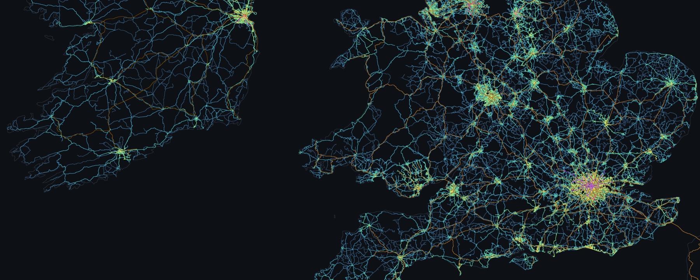

# Wayfare




Wayfare builds an aggregate dataset of public transport routes across Great Britain and Ireland. It produces a *PMTiles* archive, a tiled hierarchical map file, behind an interactive map where hovering a road lists the services on it.

## Quick start

Wales is 41 MB zipped and exercises every stage, which makes it a better first run than the national bundle. `WAYFARE_REGION` and `WAYFARE_OSM_URL` must describe the same area.

```console
$ cat > .env <<'EOF'
WAYFARE_REGION=wales
WAYFARE_OSM_URL=https://download.geofabrik.de/europe/united-kingdom/wales-latest.osm.pbf
EOF
$ direnv allow                      # or: nix develop
$ docker compose up -d valhalla     # builds its graph before it answers anything

$ wayfare acquire --region wales    # resolves its own extract URL from --region
$ wayfare patterns
$ wayfare match                     # the long one
$ wayfare aggregate
$ wayfare publish
$ wayfare status
$ wayfare serve                     # viewer on http://localhost:8099
```

## The stages

- **acquire** ([`acquire.py`](wayfare/acquire.py)). The General Transit Feed Specification (GTFS) bundle for the region, plus the National Public Transport Access Nodes (NaPTAN) stop register. `ireland` takes its bundle from the NTA and skips NaPTAN, which covers Britain only.
- **patterns** ([`gtfs.py`](wayfare/gtfs.py)). The timetable collapses to distinct ordered stop sequences, in DuckDB. `--modes` picks from the ten in `config.MODES`; the default is bus and coach, remembered in `meta.modes`.
- **match** ([`match.py`](wayfare/match.py), [`valhalla.py`](wayfare/valhalla.py)). Each pattern becomes an ordered list of road edges, road modes only. Interruption-safe: it resumes from its last committed batch.
- **trace** ([`trace.py`](wayfare/trace.py), [`osm.py`](wayfare/osm.py)). Non-road patterns with no operator shape, chiefly the London Underground and the Docklands Light Railway (DLR), cut out of OSM route relations by one cached Overpass query.
- **snap** ([`snap.py`](wayfare/snap.py)). An operator's own rail shape gets the OSM way ids it does not carry, each vertex snapped onto the track beneath it, so overlapping services share the line they run over.
- **routes** ([`osmroutes.py`](wayfare/osmroutes.py)). Services built from OSM route relations for the modes with no timetable at all, such as Great Britain's National Rail. `--cif` attributes trip counts from a Network Rail schedule.
- **aggregate** ([`aggregate.py`](wayfare/aggregate.py)). Pattern-to-edges inverted to edge-to-services, keyed on the public service number. Non-road geometry goes into `segments`, needed for trams and ferries to be drawn.
- **publish** ([`publish.py`](wayfare/publish.py)). One GeoJSON feature per line, then tippecanoe. Three tile layers come out: the banded road layer, `segments` and `track`.

[`cli.py`](wayfare/cli.py) fronts these stages plus other subcommands.

## On a server

```console
$ docker compose up -d valhalla     # first start builds the graph
$ docker compose run --rm pipeline  # every stage, acquire through publish
$ docker compose up -d web          # viewer and renderer on :8099
```

`pipeline` runs `wayfare all`, which is safe to interrupt and re-run, since every stage skips work already done. It runs the same stages in the same order as [`deploy/refresh.sh`](deploy/refresh.sh), which is for incremental updates on a schedule.

## Data sources and licences

| Source | Covers | Licence |
|---|---|---|
| DfT Bus Open Data Service (BODS) GTFS | Great Britain | Open Government Licence (OGL) v3.0 |
| NaPTAN stop register | Great Britain | OGL v3.0 |
| National Transport Authority (NTA) GTFS, published as Transport for Ireland | Republic of Ireland | Creative Commons Attribution (CC BY) 4.0 |
| Translink TransXChange timetables and MapInfo route geometry, via OpenDataNI | Northern Ireland | OGL v3.0 |
| Geofabrik OpenStreetMap extracts | all three | Open Database License (ODbL) |

## Further reading

- [`docs/data.md`](docs/data.md) — the feeds, their sizes and traps, mode filtering, coverage gaps.
- [`docs/pipeline.md`](docs/pipeline.md) — the stages, storage, DuckDB lessons, clustering, tiles.
- [`docs/results.md`](docs/results.md) — measured runs, and [`docs/deploy.md`](docs/deploy.md) the scheduled refresh.
