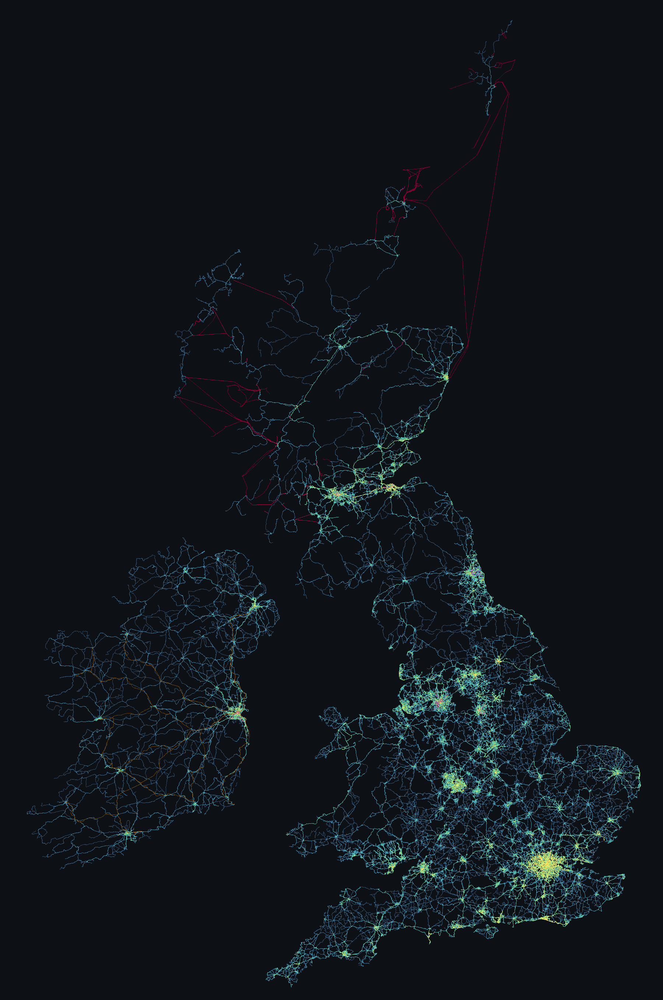

# wayfare




wayfare builds a dataset of public transport routes across these islands: Great Britain
from the Department for Transport (DfT) Bus Open Data Service (BODS), the Republic of
Ireland from the National Transport Authority (NTA), and Northern Ireland from Translink
through OpenDataNI. A timetable names the stops a service calls at and says nothing about
the roads between them. wayfare resolves every bus and coach route onto OpenStreetMap
(OSM) way identifiers and inverts the result, so each road segment carries the list of
services that use it. Tram, metro, rail and ferry have no road under them, and come from
the operator's own shape or from an OSM route relation.

Two artefacts come out: a *PMTiles* archive, one file holding a whole map's tiles, behind
an interactive map where hovering a road lists the services on it; and print-resolution
art of a chosen area, written to a file or served over HTTP.

Only 48.3% of trips in the national bundle carry a `shape_id` (measured 2026-08-06), and
the split is per-operator, so whole cities arrive with no geometry. *Map matching* is
therefore the primary path, which is why `match` runs for a day or two nationally and
cannot be skipped. It goes through Valhalla, the only engine returning OSM way ids without
a custom graph build.

## Install

The development environment is a *Nix flake* and nothing else. `direnv allow` on first entry
is the whole of the setup, and `nix develop` is the same shell without direnv. The hook
builds `.venv` with uv and re-syncs it when [`pyproject.toml`](pyproject.toml) moves, then
puts `.venv/bin` on `PATH`, so `wayfare`, `pytest -q`, `ruff check .` and `mypy` run bare.
Outside the shell none of them are on `PATH` at all.

The flake supplies Python 3.12, uv, cairo and pkg-config, felt/tippecanoe (no other fork
writes PMTiles), taplo for the TOML and the duckdb command-line interface (CLI) for
reading the database by hand; the Docker image builds tippecanoe 2.79.0 from source instead. Two things sit
outside the flake: a Valhalla server reachable at `WAYFARE_VALHALLA`, which defaults to
`http://localhost:8002`, and roughly 40 GB of free disk for a national run. All pipeline
state is one DuckDB file under `WAYFARE_DATA`.

`python scripts/coverage_badge.py` runs the suite under coverage and rewrites
`docs/coverage.svg`, the badge at the top of this page. It is committed rather than
fetched from a service, so it renders in an offline clone and on a fork with no secrets.
`--check` fails when the committed file has gone stale against a fresh measurement, and
CI runs it against the report the test step already wrote.

Two more files are generated the same way and for the same reason.
`scripts/palette_js.py` writes [`web/palette.js`](web/palette.js) from
[`wayfare/map.toml`](wayfare/map.toml), which holds every layer name and every colour
on the map: the pipeline reads the TOML and the viewer reads what the script generates,
so the two cannot hold different values for one thing. A browser has no TOML parser and
the page has to work on a static host, which is why the generated copy exists at all.
CI runs `--check` on every push, since this one needs no data.

The shape of `wayfare/map.toml` is stated in `wayfare/map.schema.json` and wired up in
`.taplo.toml`, so an editor with the *Even Better TOML* extension checks it while it is
typed and `taplo lint` fails CI on the same thing. Nothing about a wrong shape there is an
error at run time: a mistyped layer name draws an empty layer without a word.

`scripts/readme_map.py` draws the picture above out of the published archives. It has
no `--check` and CI cannot run it: every data root is gitignored and a national build
is a match run of a day or two, so the PNG is committed and the script is run by hand
when the archives move. It warns rather than writing a grey map when the band it is
given carries no `trips`.

## Quick start

Wales is 41 MB zipped and exercises every stage, which makes it a better first run than
the national bundle. `WAYFARE_REGION` and `WAYFARE_OSM_URL` must describe the same area
and nothing checks it — a mismatch fails every pattern rather than erroring. `.envrc`
loads `.env`, which Docker Compose reads as well, so a local run and a containerised one
agree.

```console
$ cat > .env <<'EOF'
WAYFARE_REGION=wales
WAYFARE_OSM_URL=https://download.geofabrik.de/europe/united-kingdom/wales-latest.osm.pbf
EOF
$ direnv allow                      # or: nix develop
$ docker compose up -d valhalla     # builds its graph before it answers anything

$ wayfare acquire --region wales    # resolves its own extract URL from --region
$ wayfare patterns
$ wayfare match                     # the long one
$ wayfare aggregate
$ wayfare publish
$ wayfare status
$ wayfare serve                     # viewer on http://localhost:8099
```

## The stages

Each stage reads what the last one wrote, and each re-runs on its own.

- **acquire** ([`acquire.py`](wayfare/acquire.py)). The General Transit Feed Specification
  (GTFS) bundle for the region, plus the National Public Transport Access Nodes (NaPTAN)
  stop register. `ireland` takes its bundle from the NTA and skips NaPTAN, which covers
  Britain only.
- **patterns** ([`gtfs.py`](wayfare/gtfs.py)). The timetable collapses to distinct ordered
  stop sequences, in DuckDB. `--modes` picks from the ten in `config.MODES`; the default is
  bus and coach, remembered in `meta.modes`.
- **match** ([`match.py`](wayfare/match.py), [`valhalla.py`](wayfare/valhalla.py)). Each
  pattern becomes an ordered list of road edges, road modes only. Interruption-safe: it
  resumes from its last committed batch.
- **trace** ([`trace.py`](wayfare/trace.py), [`osm.py`](wayfare/osm.py)). Non-road patterns
  with no operator shape, chiefly the London Underground and the Docklands Light Railway
  (DLR), cut out of OSM route relations by one cached Overpass query.
- **routes** ([`osmroutes.py`](wayfare/osmroutes.py)). Services built from OSM route
  relations for the modes with no timetable at all, such as Great Britain's National Rail.
  `--cif` attributes trip counts from a Network Rail schedule.
- **aggregate** ([`aggregate.py`](wayfare/aggregate.py)). Pattern-to-edges inverted to
  edge-to-services, keyed on the public service number rather than the GTFS `route_id`.
  Non-road geometry goes into `segments`, which is how a tram or a ferry gets drawn.
- **publish** ([`publish.py`](wayfare/publish.py)). One GeoJSON feature per line, then
  tippecanoe. Three tile layers come out: the banded road layer, `segments` and `track`.
- **art** ([`art.py`](wayfare/art.py)). A bounding box or named preset to PNG or SVG, in one
  of three styles: `density`, `spectrum` or `strands`. A PNG is drawn in horizontal bands,
  one process per core (`--workers`, or `WAYFARE_RENDER_WORKERS` for a deployment).

[`cli.py`](wayfare/cli.py) fronts those eight plus `coverage`, `draw`, `status`, `prune`,
`cluster`, `serve` and `all`, fifteen subcommands in total. `serve`
([`server.py`](wayfare/server.py)) answers the viewer, the archives and `GET /art`, which
renders a window on demand instead of only to a file. Two pages sit in `web/`, the viewer
[`index.html`](web/index.html) and the render studio [`art.html`](web/art.html);
[`web/README.md`](web/README.md) covers serving them, hosting an archive and the `/art`
parameters.

## Regions

`--region` takes a BODS slug for Great Britain (`all`, `wales`, `london` and the rest),
`ireland` for the Republic, `northern_ireland` for Northern Ireland. Both parts of Ireland
read the same 409 MB extract,
`https://download.geofabrik.de/europe/ireland-and-northern-ireland-latest.osm.pbf`,
because Geofabrik splits Ireland at the sea rather than at the border, and one extract is
one graph build and therefore one set of edge ids, so the two share a Valhalla graph. They
still need a data root each: `meta.feed_version` holds one value, so acquiring the second
region into the first's database makes it the current feed and retires the first's
patterns.

Northern Ireland is also the one region `acquire` assembles rather than downloads, because
Translink publishes no GTFS. `--region northern_ireland` resolves four OpenDataNI datasets
through CKAN and builds a bundle from the TransXChange timetables and the MapInfo road
geometry, before `patterns` runs.

`publish` writes `bus.pmtiles` into `$WAYFARE_DATA/out`; `--name-by-region` writes
`<region>.pmtiles` instead, `--region all` becoming `great_britain.pmtiles`, and `--out`
names a path outright. The viewer loads every archive it is offered onto one map, so
naming by region is what lets several sit side by side.

## On a server

```console
$ docker compose up -d valhalla     # first start builds the graph
$ docker compose run --rm pipeline  # every stage, acquire through publish
$ docker compose up -d web          # viewer and renderer on :8099
```

`pipeline` runs `wayfare all`, which is safe to interrupt and re-run, since every stage
skips work already done. It runs the same stages in the same order as
[`deploy/refresh.sh`](deploy/refresh.sh), `routes` among them, and differs only in leaving
`acquire` unforced. Compose pulls
the published `benmandrew/wayfare:latest` rather than building, so a server never compiles
tippecanoe itself; the compose file's header covers single stages and pointing
`WAYFARE_IMAGE` at a local build.

## Data sources and licences

| Source | Covers | Licence |
|---|---|---|
| DfT Bus Open Data Service (BODS) GTFS | Great Britain | Open Government Licence (OGL) v3.0 |
| NaPTAN stop register | Great Britain | OGL v3.0 |
| National Transport Authority (NTA) GTFS, published as Transport for Ireland | Republic of Ireland | Creative Commons Attribution (CC BY) 4.0 |
| Translink TransXChange timetables and MapInfo route geometry, via OpenDataNI | Northern Ireland | OGL v3.0 |
| Geofabrik OpenStreetMap extracts | all three | Open Database License (ODbL) |

CC BY 4.0 makes attribution a condition of use, so anything published from the NTA's feed
has to credit the National Transport Authority. `wayfare acquire` prints the licence and
the credit on every run, whether it fetches the bundle or finds it already there.

The credit then travels with the data. `wayfare publish` stamps it into the archive's own
tileset metadata, with OpenStreetMap's ODbL credit alongside it wherever a route was
matched onto an OSM way or traced along one, so a copy into someone else's bucket keeps
it and the viewer shows it in the map's attribution control. Every PNG and SVG that
`wayfare art` writes holds the same credit in its own file metadata, and `--credit`, or
`credit=1` on `/art`, draws it into the bottom corner as well.

## Further reading

- [`docs/data.md`](docs/data.md) — the feeds, their sizes and traps, mode filtering,
  coverage gaps.
- [`docs/pipeline.md`](docs/pipeline.md) — the stages, storage, DuckDB lessons, clustering,
  tiles.
- [`docs/rendering.md`](docs/rendering.md) — how `art` draws, and where a render's time
  goes.
- [`docs/results.md`](docs/results.md) — measured runs, and
  [`docs/deploy.md`](docs/deploy.md) the scheduled refresh.
- [`CLAUDE.md`](CLAUDE.md) — the architecture in brief, and the rules a change has to hold
  to.

Most of the `docs/` pages record something that was a bug first, so the one covering an
area is worth reading before touching it.
